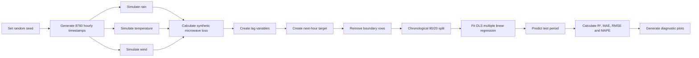

# Microwave Signal Loss Prediction

<p align="center">
  <strong>One-step-ahead microwave attenuation forecasting with Multiple Linear Regression in R</strong>
</p>

<p align="center">
  
  
  
  
  
</p>

---

## Overview

**Microwave Signal Loss Prediction** is a reproducible machine-learning and time-series forecasting study that estimates microwave signal attenuation one hour ahead from simulated meteorological conditions.

The project generates a complete year of hourly observations, creates temporal lag features, trains an Ordinary Least Squares Multiple Linear Regression model, evaluates it on a chronologically separated test period, and produces five diagnostic visualizations.

The model uses:

- Current rain rate
- Current temperature
- Current wind speed
- Previous-hour rain rate
- Previous-hour signal loss

The target is the signal loss at the following hour.

> [!IMPORTANT]
> This repository is a **synthetic-data proof of concept**. It demonstrates the full forecasting workflow, but it is not a field-calibrated microwave propagation model. Operational use requires validation against real link measurements.

---

## Key Results

| Metric | Result | Interpretation |
|---|---:|---|
| **R²** | **72.83%** | Approximately 72.83% of the test-period variance is explained. |
| **MAE** | **0.2947 dB** | Average absolute prediction error is below 0.30 dB. |
| **RMSE** | **0.3695 dB** | Large errors remain limited in the simulated test set. |
| **MAPE** | **1.41%** | Average percentage deviation is low in the simulated operating range. |

These values indicate strong predictive performance within the controlled synthetic environment.

A low MAPE and a moderate R² are not contradictory. The simulated signal loss contains a baseline near 20 dB, so an absolute error below 0.4 dB produces a small percentage error, while R² measures the fraction of variation around the test-set mean that is explained.

---

## Project Workflow



---

## Repository Structure

```text
Microwave-Signal-Loss-Prediction/
├── README.md
└── microwave_attenuation.R
```

| File | Description |
|---|---|
| `microwave_attenuation.R` | Complete R workflow for simulation, feature engineering, model fitting, evaluation, and visualization. |
| `README.md` | Technical documentation for the project. |

---

## Project Objectives

1. Build a reproducible hourly microwave-channel simulation covering one year.
2. Represent temporal persistence through lagged weather and attenuation variables.
3. Formulate microwave attenuation forecasting as a supervised regression problem.
4. Preserve chronological order during model validation.
5. Quantify performance using complementary error metrics.
6. Diagnose residual behavior and regression assumptions visually.
7. Establish a transparent baseline for future comparison with more advanced models.

---

## Methodology

### Simulation Horizon

The simulation contains:

- **Duration:** 365 days
- **Sampling interval:** 1 hour
- **Initial observations:** 8,760
- **Random seed:** 42

The time indices are calculated as:

```text
day(t)  = floor((t - 1) / 24) + 1
hour(t) = ((t - 1) mod 24) + 1
```

This supports both annual and daily periodic behavior.

### Rain Generation

Rain is generated from an absolute-valued AR(1) process with strong persistence and annual modulation:

```r
rain_rate <- abs(arima.sim(list(ar = 0.98), n = N)) * 2 *
  (1 + 0.4 * sin(2 * pi * day_of_year / 365 - pi / 2))
```

The autoregressive coefficient of 0.98 creates slowly evolving rain conditions rather than independent hour-to-hour values.

Conceptually:

```text
R(t) = 2 |x(t)| [1 + 0.4 sin(2π d(t)/365 - π/2)]
```

where `x(t)` follows an AR(1) process.

### Temperature Generation

Temperature combines annual seasonality, daily seasonality, and Gaussian noise:

```r
temp <- 25 +
  8 * sin(2 * pi * day_of_year / 365 - pi / 2) +
  2 * sin(2 * pi * hour_of_day / 24 - pi / 3) +
  rnorm(N, 0, 0.5)
```

The annual term controls seasonal variation, while the daily term models intraday temperature changes.

### Wind Generation

Wind is generated from another persistent autoregressive process:

```r
wind <- abs(arima.sim(list(ar = 0.95), n = N)) + 3
```

The constant offset keeps wind values positive, while the AR coefficient of 0.95 introduces temporal continuity.

---

## Synthetic Signal-Loss Model

The simulated microwave loss is calculated as:

```r
signal_loss <- 20 +
  (0.00454 * (rain_rate^1.353) * 10) +
  (0.0003 * temp) +
  (0.05 * wind) +
  rnorm(N, 0, 0.3)
```

Equivalent form:

```text
L(t) = 20 + 0.00454 R(t)^1.353 × 10 + 0.0003 T(t) + 0.05 W(t) + η(t)
```

where `η(t)` is Gaussian noise with a standard deviation of 0.3 dB.

### Interpretation

- `20` represents the nominal baseline loss in the synthetic scenario.
- `0.00454 × Rain^1.353` follows the power-law structure used in rain-specific attenuation models.
- Multiplication by `10` represents a fixed effective path-length factor in the simulation.
- Temperature introduces a small linear perturbation.
- Wind introduces an additional environmental term.
- Gaussian noise represents unmodeled effects and measurement uncertainty.

The rain component is **ITU-R P.838-inspired**, not a complete implementation of the recommendation. A full implementation would derive the rain coefficients from frequency, polarization, elevation angle, and link geometry.

---

## Feature Engineering

The project creates lagged variables and the future target as follows:

```r
mw_data$Loss_Lag1 <- c(NA, mw_data$Loss[-N])
mw_data$Rain_Lag1 <- c(NA, mw_data$Rain[-N])
mw_data$Next_Loss <- c(mw_data$Loss[-1], NA)
mw_data <- na.omit(mw_data)
```

At timestamp `t`, the implemented feature vector is:

```text
X(t) = [Rain(t), Temp(t), Wind(t), Rain(t-1), Loss(t-1)]
```

and the target is:

```text
y(t) = Loss(t+1)
```

The first row lacks lag values and the last row lacks a future target. Therefore:

```text
8760 - 2 = 8758 usable observations
```

> [!NOTE]
> The target is `Loss(t+1)`, but `Loss_Lag1` is `Loss(t-1)`. Relative to the prediction target, this is a two-hour separation. Adding the current `Loss(t)` value would create a stronger persistence baseline and a more conventional one-step autoregressive formulation.

---

## Train-Test Strategy

The usable dataset is divided chronologically:

```r
split_idx <- floor(0.8 * nrow(mw_data))
train_data <- mw_data[1:split_idx, ]
test_data  <- mw_data[(split_idx + 1):nrow(mw_data), ]
```

| Subset | Observations | Share |
|---|---:|---:|
| Training | 7,006 | Approximately 80% |
| Testing | 1,752 | Approximately 20% |
| Total usable | 8,758 | 100% |

No random shuffling is used. This prevents future observations from entering the training set while earlier observations appear in the test set.

Chronological validation is essential because neighboring samples are strongly correlated. A random split could produce an unrealistically optimistic performance estimate.

---

## Regression Model

The model is fitted with R's base `lm()` function:

```r
model <- lm(
  Next_Loss ~ Rain + Temp + Wind + Rain_Lag1 + Loss_Lag1,
  data = train_data
)
```

The model can be expressed as:

```text
Predicted Loss(t+1)
  = β0
  + β1 Rain(t)
  + β2 Temp(t)
  + β3 Wind(t)
  + β4 Rain(t-1)
  + β5 Loss(t-1)
```

The coefficients are estimated by Ordinary Least Squares, minimizing the sum of squared residuals.

The model is intentionally simple and interpretable, making it suitable as a baseline for future comparison with nonlinear and sequence-based forecasting methods.

---

## Evaluation Metrics

Predictions are generated on the untouched chronological test period:

```r
Actual <- test_data$Next_Loss
Predicted <- predict(model, test_data)
Residuals <- Predicted - Actual
```

The script defines residuals as:

```text
Residual = Predicted - Actual
```

Positive residuals indicate overprediction; negative residuals indicate underprediction.

### Mean Absolute Error

```text
MAE = mean(|Predicted - Actual|)
```

MAE expresses the typical absolute prediction error directly in dB.

### Root Mean Squared Error

```text
RMSE = sqrt(mean((Predicted - Actual)^2))
```

RMSE penalizes larger errors more strongly than MAE.

### Mean Absolute Percentage Error

```text
MAPE = mean(|Residual / Actual|) × 100
```

MAPE is numerically stable here because the simulated loss remains far from zero.

### Coefficient of Determination

```text
R² = 1 - SS_res / SS_tot
```

The script calculates out-of-sample R² directly from test predictions rather than reporting the training-set value from `summary(model)`.

---

## Diagnostic Visualizations

The R script produces five diagnostic plots.

### 1. Actual vs Predicted Loss

The scatter plot compares actual synthetic values with model predictions. The red dashed 45-degree line represents perfect prediction. Points close to the line indicate accurate estimates.

### 2. Residual Distribution

A histogram checks whether prediction errors are centered around zero and approximately symmetric. The reported residuals form a near bell-shaped distribution with mild tail deviations.

### 3. Normal Q-Q Plot

The Q-Q plot compares empirical residual quantiles with theoretical normal quantiles. Most points follow the reference line, while the extreme tails show small deviations.

### 4. Residuals Over Time

The time-ordered residual plot is used to inspect:

- Bias
- Changing variance
- Clustering
- Periodicity
- Unmodeled temporal structure
- Large transient errors

Residuals fluctuate around zero with broadly stable variance. Rapid weather transitions can still produce larger errors.

### 5. Regression Coefficients

The coefficient chart displays fitted slope estimates. `Loss_Lag1` is expected to carry strong predictive information because attenuation is temporally persistent.

> [!CAUTION]
> Raw coefficients are scale-dependent. Rain, temperature, wind, and signal loss use different units, so raw coefficient magnitude is not a unit-independent measure of feature importance. Standardized coefficients, partial R², permutation importance, or SHAP-based analysis would be more defensible.

---

## Results and Interpretation

### Predictive Accuracy

The model achieves sub-dB average errors in the synthetic test period:

- MAE: approximately 0.295 dB
- RMSE: approximately 0.370 dB
- MAPE: approximately 1.41%

The relatively small difference between RMSE and MAE suggests that the error distribution is not dominated by a large number of extreme outliers.

### Explained Variance

An out-of-sample R² of 72.83% means that the model captures most, but not all, of the test-period variation.

Unexplained variance is expected because:

- Random noise is deliberately added to the loss model.
- Rain influences attenuation nonlinearly through `Rain^1.353`.
- The regression receives untransformed rain as a linear predictor.
- Current signal loss is not directly included.
- Residual temporal dependence may remain.

### Multicollinearity

Current and previous-hour rain are strongly correlated because rain is generated with an AR coefficient of 0.98.

Strong predictor correlation can cause:

- Unstable individual coefficients
- Unexpected coefficient signs
- Increased standard errors
- Reduced reliability of coefficient-level interpretation

Prediction accuracy may remain strong even when individual coefficients are difficult to interpret physically.

---

## Installation and Usage

### Requirements

- R 4.0 or newer is recommended
- Windows, Linux, or macOS
- No external R packages are required

The script uses standard R functionality from `stats`, `graphics`, and `grDevices`.

### Clone the Repository

```bash
git clone https://github.com/csondurr/Microwave-Signal-Loss-Prediction.git
cd Microwave-Signal-Loss-Prediction
```

### Run from a Terminal

```bash
Rscript microwave_attenuation.R
```

### Run in RStudio

```r
source("microwave_attenuation.R")
```

### Expected Console Output

```text
R-squared (%) : 72.83 %
MAE (Unit)    : 0.2947
RMSE (Unit)   : 0.3695
MAPE (%)      : 1.41 %
===========================================
```

The exact output may vary slightly between R versions because random-number-generation behavior and numerical libraries can differ.

---

## Reproducibility

Reproducibility is controlled by:

```r
set.seed(42)
```

After random data generation, the workflow is deterministic because:

- Feature-engineering rules are fixed.
- The split index is fixed by dataset length.
- The split is chronological.
- OLS fitting is deterministic.
- No stochastic optimizer is used.

For stricter environment tracking, record:

```r
sessionInfo()
R.version.string
RNGkind()
```

---

## Why a Linear Model Can Predict a Nonlinear Process

The synthetic loss equation includes a nonlinear rain term, yet linear regression still performs well because:

- Rain values occupy a limited operating range.
- A nonlinear function can be locally approximated linearly.
- Lagged signal loss carries information about the nonlinear weather response.
- Temperature and wind contributions are linear.
- The dataset exhibits strong temporal persistence.

A transformed feature such as `Rain^1.353` would better align the regression model with the data-generating process.

---

## Limitations

### Synthetic Data

Real microwave links include effects not represented by the simulation:

- Carrier frequency
- Polarization
- Antenna gain and alignment
- Path length and terrain
- Atmospheric gases
- Cloud and fog attenuation
- Multipath fading
- Wet-antenna attenuation
- Hardware drift
- Electromagnetic interference
- Missing or delayed sensor measurements

### Simplified Rain Attenuation

The rain term uses fixed coefficients rather than coefficients calculated from the actual carrier frequency, polarization, and elevation angle.

### Model Mismatch

The synthetic process contains `Rain^1.353`, while the regression uses untransformed rain.

### Current Loss Is Not Included

The target is `Loss(t+1)`, but the loss predictor is `Loss(t-1)`. The most recent available value, `Loss(t)`, is omitted.

### No Persistence Baseline

The model is not compared against the simple forecast:

```text
Predicted Loss(t+1) = Loss(t)
```

A forecasting model should outperform this baseline before being considered operationally useful.

### Single Holdout Period

A single 80/20 split does not quantify performance variability across seasons or alternative test windows.

### No Prediction Intervals

The current implementation produces point predictions only and does not quantify forecast uncertainty.

---

## Recommended Improvements

### High-Priority Changes

1. Include current signal loss:

```r
model <- lm(
  Next_Loss ~ Loss + Rain + Temp + Wind + Rain_Lag1 + Loss_Lag1,
  data = train_data
)
```

2. Add a physically motivated nonlinear rain feature:

```r
mw_data$Rain_Attenuation_Term <- mw_data$Rain^1.353
```

3. Compare against a persistence baseline:

```r
baseline_prediction <- test_data$Loss
```

4. Quantify multicollinearity with Variance Inflation Factors.
5. Check residual autocorrelation with ACF and Ljung-Box testing.
6. Add Breusch-Pagan testing for heteroscedasticity.
7. Save plots and predictions automatically.
8. Add prediction intervals.

### Validation Improvements

- Rolling-origin evaluation
- Expanding-window backtesting
- Seasonal holdout periods
- Performance stratified by rain intensity
- Bootstrap uncertainty analysis
- Separate dry, moderate-rain, and heavy-rain metrics

### Candidate Models

- Linear regression with transformed features
- Ridge regression
- Lasso regression
- Elastic Net
- Generalized Additive Models
- ARIMA or ARIMAX
- Random Forest
- Gradient Boosting
- XGBoost
- Support Vector Regression
- LSTM networks
- Temporal Convolutional Networks

More complex models should only be adopted if they outperform transparent baselines under proper time-series validation.

---

## Potential Applications

After validation with real measurements, this workflow could support:

- Microwave backhaul quality prediction
- Adaptive modulation and coding
- Link-margin monitoring
- Weather-aware network planning
- Preventive maintenance
- Rain-fade alarms
- Satellite and terrestrial link analysis
- Dynamic power-control research
- Communication-infrastructure reliability studies

These are future application areas, not claims of current operational readiness.

---

## References

The project is conceptually related to:

1. **ITU-R P.838** — Specific attenuation model for rain in terrestrial and Earth-space links.
2. **Ordinary Least Squares** — Classical estimation for multiple linear regression.
3. **Autoregressive Processes** — Time-series models used to simulate persistent weather variables.
4. **Time-Series Validation** — Chronological holdout and rolling-origin evaluation.
5. **Residual Diagnostics** — Normality, heteroscedasticity, autocorrelation, and multicollinearity analysis.

---

## Author

**Cem Sondur**

Electrical and Electronics Engineering  
Machine Learning · Microwave Engineering · Signal Processing

---

## Citation

```text
C. Sondur, "Microwave Signal Loss Prediction: One-Step-Ahead Forecasting
with Multiple Linear Regression in R," GitHub repository.
```

---

## License

No open-source license is currently included. Until a `LICENSE` file is added, reuse, modification, and redistribution rights are not explicitly granted.
